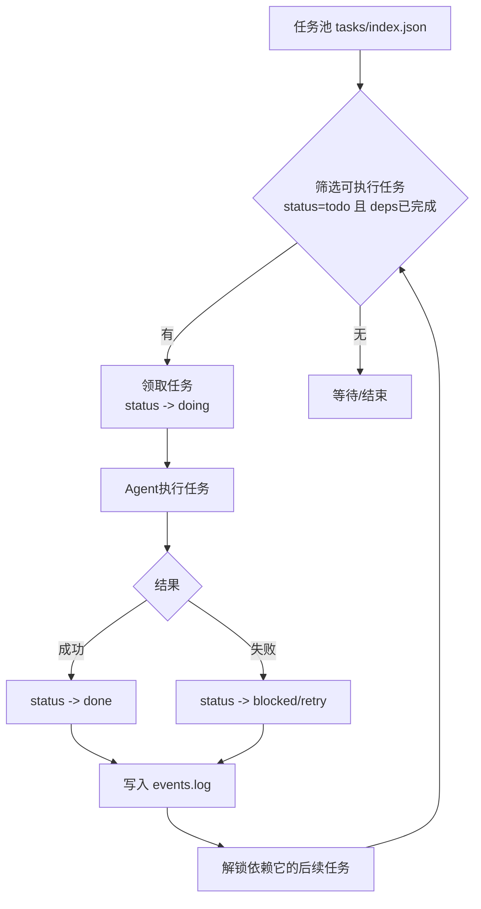
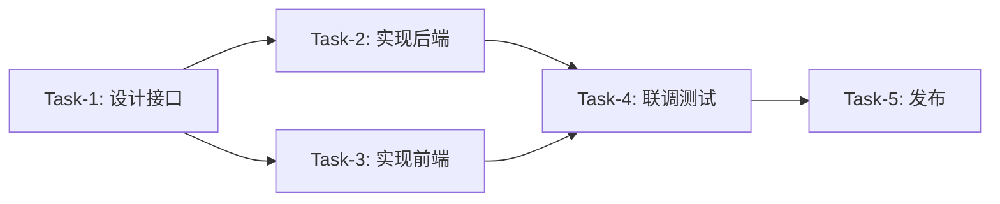

# Session: 2026-03-23 00:59:07 UTC

- **Session Key**: agent:main:feishu:group:oc_eadd210e001008da96480fec46a72a0a
- **Session ID**: 0f0a8024-20f1-431f-9a7e-ba1d3d229ab2
- **Source**: feishu

## Conversation Summary

assistant: [[reply_to_current]]好，我来当你的「Claude Code 教练」，可以定时推送精简版内容。先给你一个轻量计划（10 天）：

1. Claude Code 是什么（能力边界 + 适用场景）  
2. 最小可运行 agent harness（输入→决策→执行→反馈）  
3. Prompt 结构（系统/任务/约束）  
4. 工具调用与安全（白名单、权限、失败回退）  
5. 上下文管理（短期记忆/长期记忆）  
6. 循环与终止条件（何时继续、何时停）  
7. 错误处理（重试、降级、人工接管）  
8. 可观测性（日志、指标、成本）  
9. 从 demo 到实战（改造成你自己的工作流）  
10. 总复习 + 实战作业

每次我会发：**3 分钟可读**（核心概念 + 1 个例子 + 1 个小练习）。  
你定一下推送规则：**每天几点、每周几次、发这个群还是私聊**，我就按这个节奏开始发。
user: Conversation info (untrusted metadata):
```json
{
  "message_id": "om_x100b533c9bd630b0b36aadcae013a12",
  "sender_id": "ou_21d88a5f4275e2f3bd2fcd1d654f6497",
  "conversation_label": "oc_eadd210e001008da96480fec46a72a0a",
  "sender": "ou_21d88a5f4275e2f3bd2fcd1d654f6497",
  "timestamp": "Mon 2026-03-23 08:46 GMT+8",
  "group_subject": "oc_eadd210e001008da96480fec46a72a0a",
  "is_group_chat": true
}
```

Sender (untrusted metadata):
```json
{
  "label": "ou_21d88a5f4275e2f3bd2fcd1d654f6497",
  "id": "ou_21d88a5f4275e2f3bd2fcd1d654f6497",
  "name": "ou_21d88a5f4275e2f3bd2fcd1d654f6497"
}
```

[message_id: om_x100b533c9bd630b0b36aadcae013a12]
ou_21d88a5f4275e2f3bd2fcd1d654f6497: 发这个群，压缩到3天学完，第一篇现在发
assistant: [[reply_to_current]]好，走 3 天冲刺版。今天先发 **第 1 篇**（精简版，5 分钟读完）。

**3天学习安排**
- **Day 1：** Claude Code 本质 + 最小工作流（今天）
- **Day 2：** 工具调用、安全边界、错误处理
- **Day 3：** 记忆与上下文、可观测性、实战落地模板

---

## Day 1｜Claude Code 到底在干嘛？

### 1) 一句话理解
Claude Code 不是“会写代码的聊天机器人”，而是一个**可循环执行任务的代理框架**：  
**理解目标 → 拆步骤 → 调工具/执行命令 → 看结果 → 继续迭代直到完成或停机。**

### 2) 最小闭环（你要记住的核心）
```
目标输入
  ↓
规划下一步
  ↓
执行动作（读文件/跑命令/改代码）
  ↓
观察结果
  ↓
判断：完成？继续？回退？
```
你看到的“很聪明”，本质是这个闭环跑得稳。

### 3) 和普通 AI 问答的关键区别
- 普通问答：一次性给答案  
- Claude Code：**多步执行 + 可验证结果**（不是只说，是真做）

### 4) 一个超短例子
目标：修一个测试失败  
- Step1 读报错日志  
- Step2 定位文件并改动  
- Step3 跑测试  
- Step4 若仍失败，继续定位；若通过，输出变更总结  
这就是 agent harness 的最小实战。

### 5) 今天小练习（3分钟）
你拿任意任务，用这 4 句话写出来：
1. 目标是什么？  
2. 第一步先看什么？  
3. 准备用什么工具/命令？  
4. 什么结果算完成？

---

如果你愿意，我下一条就接着发 **Day 2（工具调用 + 安全边界）**，同样压缩成 5 分钟版。
user: Conversation info (untrusted metadata):
```json
{
  "message_id": "om_x100b533c97539ca0b2c3c28f12778af",
  "sender_id": "ou_21d88a5f4275e2f3bd2fcd1d654f6497",
  "conversation_label": "oc_eadd210e001008da96480fec46a72a0a",
  "sender": "ou_21d88a5f4275e2f3bd2fcd1d654f6497",
  "timestamp": "Mon 2026-03-23 08:47 GMT+8",
  "group_subject": "oc_eadd210e001008da96480fec46a72a0a",
  "is_group_chat": true
}
```

Sender (untrusted metadata):
```json
{
  "label": "ou_21d88a5f4275e2f3bd2fcd1d654f6497",
  "id": "ou_21d88a5f4275e2f3bd2fcd1d654f6497",
  "name": "ou_21d88a5f4275e2f3bd2fcd1d654f6497"
}
```

[message_id: om_x100b533c97539ca0b2c3c28f12778af]
ou_21d88a5f4275e2f3bd2fcd1d654f6497: day2
assistant: [[reply_to_current]]## Day 2｜工具调用 + 安全边界 + 错误处理（5分钟版）

### 1) 先记一句话
代理真正的价值不在“会说”，在**会安全地做**。  
核心公式：**最小权限 + 可回滚 + 可观测**。

### 2) 工具调用的正确顺序（实战）
1. **先读后写**：先看文件/现状，再改  
2. **小步提交**：一次只改一块，方便定位问题  
3. **改完即验**：立刻跑测试/命令验证  
4. **失败可退**：保留回退点（diff/commit）

### 3) 安全边界（必须有）
- **白名单工具**：只允许必要命令/接口  
- **高危动作需确认**：删除、外部发送、生产操作  
- **作用域限制**：尽量只在目标目录工作  
- **敏感信息最小暴露**：token/密钥不进日志

### 4) 错误处理三板斧
- **重试**：网络抖动类错误，短次数重试  
- **降级**：A 方案失败，换 B 方案（例如改用只读路径）  
- **人工接管**：连续失败或风险升高，立刻停并上报

### 5) 一个极简模板
- 目标：修复 X  
- 风险：会改动 Y 文件  
- 执行：读取→修改→测试→总结  
- 失败策略：重试 1 次；仍失败则回滚并报告

### 6) 今日练习（3分钟）
给你一个任务，补齐这三句：
1. 这次操作的**最大风险**是什么？  
2. 我用什么方式保证**可回滚**？  
3. 什么情况下必须**停机并叫人**？

---

你回我“day3”，我就发最后一篇：**记忆与上下文 + 可观测性 + 落地执行模板**。
user: Conversation info (untrusted metadata):
```json
{
  "message_id": "om_x100b533c9000ccb0b221f04fbf9c38e",
  "sender_id": "ou_21d88a5f4275e2f3bd2fcd1d654f6497",
  "conversation_label": "oc_eadd210e001008da96480fec46a72a0a",
  "sender": "ou_21d88a5f4275e2f3bd2fcd1d654f6497",
  "timestamp": "Mon 2026-03-23 08:48 GMT+8",
  "group_subject": "oc_eadd210e001008da96480fec46a72a0a",
  "is_group_chat": true
}
```

Sender (untrusted metadata):
```json
{
  "label": "ou_21d88a5f4275e2f3bd2fcd1d654f6497",
  "id": "ou_21d88a5f4275e2f3bd2fcd1d654f6497",
  "name": "ou_21d88a5f4275e2f3bd2fcd1d654f6497"
}
```

[message_id: om_x100b533c9000ccb0b221f04fbf9c38e]
ou_21d88a5f4275e2f3bd2fcd1d654f6497: 这些太少了，我本身就是一个开发者，你觉得我应该着重去看哪个部分
assistant: [[reply_to_current]]你是开发者的话，别按 Day1-3 入门节奏了，直接看这 4 块（收益最高）：

1. **`s07_task_system` + `s12_worktree_task_isolation`**  
   这是“能不能工程化落地”的分水岭：任务图持久化 + 并行隔离执行。  
2. **`s04_subagent` + `s09/s10/s11`**  
   子 agent、团队协作协议、自组织认领，决定系统上限。  
3. **`s06_context_compact`**  
   真正跑久了都会死在上下文膨胀，这章是可持续运行核心。  
4. **`s08_background_tasks`**  
   把慢操作异步化，不阻塞主循环，实战里非常关键。

如果你时间只够看一个部分：**优先 s07+s12**。  
一句话：先把“任务系统 + 隔离执行”吃透，再看多 agent 协作，你会比大多数教程快两个层级。
user: Conversation info (untrusted metadata):
```json
{
  "message_id": "om_x100b533ca7c778acb222734b220b497",
  "sender_id": "ou_21d88a5f4275e2f3bd2fcd1d654f6497",
  "conversation_label": "oc_eadd210e001008da96480fec46a72a0a",
  "sender": "ou_21d88a5f4275e2f3bd2fcd1d654f6497",
  "timestamp": "Mon 2026-03-23 08:51 GMT+8",
  "group_subject": "oc_eadd210e001008da96480fec46a72a0a",
  "is_group_chat": true
}
```

Sender (untrusted metadata):
```json
{
  "label": "ou_21d88a5f4275e2f3bd2fcd1d654f6497",
  "id": "ou_21d88a5f4275e2f3bd2fcd1d654f6497",
  "name": "ou_21d88a5f4275e2f3bd2fcd1d654f6497"
}
```

[message_id: om_x100b533ca7c778acb222734b220b497]
ou_21d88a5f4275e2f3bd2fcd1d654f6497: 第一篇
assistant: [[reply_to_current]]好，开发者版第 1 篇我直接从最关键的讲：**`s07 Task System`（任务系统）**。

## 第1篇｜Task System：把“会做事”变成“可管理地做事”

### 你要解决的核心问题
普通 agent 往往只有“当前对话状态”，没有真正的任务管理能力，结果就是：
- 做到一半丢目标
- 复杂任务拆不清
- 多 agent 协作全靠上下文碰运气

**Task System 的本质：把任务从“prompt里的文字”升级成“磁盘上的状态机”。**

---

### 一、最小数据模型（够用就行）
先别追求完美 schema，先要可跑：

- `task_id`
- `title`
- `status`：`todo | doing | blocked | done`
- `priority`
- `deps`（依赖任务）
- `assignee`（可空）
- `artifacts`（输出路径、PR链接、日志等）

一句话：**任务是对象，不是聊天记录。**

---

### 二、执行循环怎么接 Task System
经典 loop 外面包一层任务调度：

1. 读取任务池（持久化文件）
2. 找出 `todo` 且依赖已完成的任务
3. 标记 `doing`，分配给 agent
4. 执行后写回 `done/blocked`
5. 触发下一个可执行任务

> 重点：状态写盘要原子化（先写临时文件再替换），避免并发损坏。

---

### 三、为什么这一步是分水岭
有了 Task System，你才能做到：

- **可恢复**：进程挂了能续跑
- **可审计**：知道每步谁做了什么
- **可并行**：把无依赖任务同时发给多个 agent
- **可治理**：失败重试、超时、人工接管都有落点

没有它，多 agent 只是“多人聊天”；有它，才是“工程系统”。

---

### 四、你现在就能落地的简化实现
先用 JSON 文件就够：

- `tasks/index.json`：任务列表
- `tasks/events.log`：状态变更流水
- 每次变更都 append 一条 event（可回放）

这样你立刻拥有：
- 最小事件溯源
- 调试能力
- 崩溃恢复基础

---

### 五、今天的开发者练习（15分钟）
做一个 20 行级别的调度器原型，支持：

- 创建 3 个任务（含依赖）
- 自动挑选可执行任务
- 完成后解锁后续任务
- 打印当前 DAG 状态

你做完我就发**第2篇：`s12 Worktree Isolation`**（任务系统的最佳搭档，解决并行互相污染）。
user: Conversation info (untrusted metadata):
```json
{
  "message_id": "om_x100b533ca0673090b2cc9053fd8b43a",
  "sender_id": "ou_21d88a5f4275e2f3bd2fcd1d654f6497",
  "conversation_label": "oc_eadd210e001008da96480fec46a72a0a",
  "sender": "ou_21d88a5f4275e2f3bd2fcd1d654f6497",
  "timestamp": "Mon 2026-03-23 08:52 GMT+8",
  "group_subject": "oc_eadd210e001008da96480fec46a72a0a",
  "is_group_chat": true
}
```

Sender (untrusted metadata):
```json
{
  "label": "ou_21d88a5f4275e2f3bd2fcd1d654f6497",
  "id": "ou_21d88a5f4275e2f3bd2fcd1d654f6497",
  "name": "ou_21d88a5f4275e2f3bd2fcd1d654f6497"
}
```

[message_id: om_x100b533ca0673090b2cc9053fd8b43a]
ou_21d88a5f4275e2f3bd2fcd1d654f6497: 还挺抽象的，如果有个图给我看就好了，你把图片发聊天附件给我看看
assistant: [[reply_to_current]]可以给你图，但我这边当前不能直接发聊天附件。先给你一个**可直接渲染的 Mermaid 图**（你贴到任意支持 Mermaid 的编辑器就能看）：



再给你一个**任务依赖 DAG 示例图**：



你要的话我下一条就给你发 **s12 的隔离执行图（主仓库 + 多 worktree 并行）**。
user: Conversation info (untrusted metadata):
```json
{
  "message_id": "om_x100b533cbdf53494b1032595b3229bb",
  "sender_id": "ou_21d88a5f4275e2f3bd2fcd1d654f6497",
  "conversation_label": "oc_eadd210e001008da96480fec46a72a0a",
  "sender": "ou_21d88a5f4275e2f3bd2fcd1d654f6497",
  "timestamp": "Mon 2026-03-23 08:54 GMT+8",
  "group_subject": "oc_eadd210e001008da96480fec46a72a0a",
  "is_group_chat": true
}
```

Sender (untrusted metadata):
```json
{
  "label": "ou_21d88a5f4275e2f3bd2fcd1d654f6497",
  "id": "ou_21d88a5f4275e2f3bd2fcd1d654f6497",
  "name": "ou_21d88a5f4275e2f3bd2fcd1d654f6497"
}
```

[message_id: om_x100b533cbdf53494b1032595b3229bb]
ou_21d88a5f4275e2f3bd2fcd1d654f6497: 你的目标是教会我，而非压缩内容科普我
assistant: [[reply_to_current]]说得对，我刚才是“讲概念”，不是“带你学会”。我们改成**教练模式**：每一节都按「目标→动手→验收→复盘」，你做完我再放下一节，不再只给你科普。

从现在开始第 1 课验收标准只有一个：你能自己写出一个最小任务调度器（支持依赖解锁）。  
我下一条直接给你**可运行骨架代码 + 你要补的 3 处空白 + 预期输出**，你填完我帮你 code review。
user: Conversation info (untrusted metadata):
```json
{
  "message_id": "om_x100b533cbb47c0a8b3d1fdf3f67da4b",
  "sender_id": "ou_21d88a5f4275e2f3bd2fcd1d654f6497",
  "conversation_label": "oc_eadd210e001008da96480fec46a72a0a",
  "sender": "ou_21d88a5f4275e2f3bd2fcd1d654f6497",
  "timestamp": "Mon 2026-03-23 08:54 GMT+8",
  "group_subject": "oc_eadd210e001008da96480fec46a72a0a",
  "is_group_chat": true
}
```

Sender (untrusted metadata):
```json
{
  "label": "ou_21d88a5f4275e2f3bd2fcd1d654f6497",
  "id": "ou_21d88a5f4275e2f3bd2fcd1d654f6497",
  "name": "ou_21d88a5f4275e2f3bd2fcd1d654f6497"
}
```

[message_id: om_x100b533cbb47c0a8b3d1fdf3f67da4b]
ou_21d88a5f4275e2f3bd2fcd1d654f6497: 不要让我做作业，你就讲课
assistant: [[reply_to_current]]收到，那就纯讲课，我来讲清楚，不给你留作业。  
下面这节就是开发者视角的 **Task System 实战课（s07 精讲）**。

**1) 为什么必须有 Task System**  
当任务复杂到“>3步、多人/多agent参与、可能中断重启”时，只靠对话上下文一定会漂。  
Task System 的作用是把“意图”变成“可计算状态”。

**2) 最小架构（你可以直接套到任何 agent）**  
- `Task Store`：任务持久化（JSON/SQLite都行）  
- `Scheduler`：挑选可执行任务（依赖满足 + 优先级）  
- `Executor`：真正调用 agent/tool 执行  
- `State Machine`：状态流转（todo→doing→done/blocked）  
- `Event Log`：记录每次状态变化（可审计/可恢复）

**3) 关键不是字段，而是状态机约束**  
推荐状态：`todo / doing / blocked / done / failed / cancelled`  
核心约束：  
- 只有 `todo` 能进入 `doing`  
- 只有 `doing` 能进入 `done|failed|blocked`  
- `blocked` 必须带原因和解除条件  
这让系统“可推理”，而不是一堆松散标签。

**4) 调度算法本质**  
每轮只做三件事：  
- 找到 `todo` 且 `deps 全 done` 的任务  
- 按 `priority + createdAt` 排序  
- 领一个执行并加锁（防止并发重复执行）  
这就是可扩展调度器的核心。

**5) 为什么 s07 是工程分水岭**  
因为它把 agent 从“会一次性解决问题”升级成“可长期运行的任务工人”：  
- 崩了能恢复（状态在盘上）  
- 慢任务能排队  
- 多agent能协作（共享任务图）  
- 可以接入审批、重试、SLA、告警

**6) 你在生产环境最该关注的 3 个坑**  
- **幂等性**：重试不能造成副作用翻倍  
- **并发锁**：任务不能被两个执行器同时领取  
- **可观测性**：每个任务必须可追踪（谁领的、跑了多久、失败原因）

如果你认可这节节奏，我下一节直接讲 **s12：Task System + Git Worktree 的并行隔离模式**（这是从“能跑”到“能稳定并行跑”的关键）。
